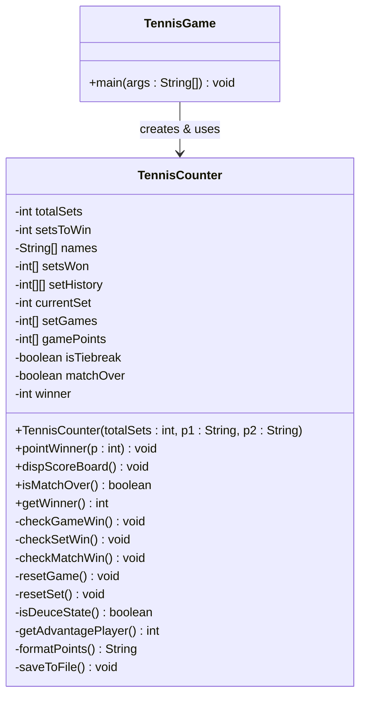

# 테니스 게임 클래스 다이어그램



## 필드 설명

| 필드 | 타입 | 설명 |
|------|------|------|
| `totalSets` | int | 경기 세트 수 (3 또는 5) |
| `setsToWin` | int | 최종 승리에 필요한 세트 수 (2 또는 3) |
| `names` | String[] | 두 선수 이름 [0]=선수1, [1]=선수2 |
| `setsWon` | int[] | 각 선수의 세트 승리 수 |
| `setHistory` | int[][] | 완료된 세트별 게임 스코어 기록 |
| `currentSet` | int | 현재 진행 중인 세트 인덱스 |
| `setGames` | int[] | 현재 세트에서 각 선수의 게임 수 |
| `gamePoints` | int[] | 현재 게임에서 각 선수의 포인트 (내부 정수값) |
| `isTiebreak` | boolean | 현재 게임이 타이브레이크인지 여부 |
| `matchOver` | boolean | 경기 종료 여부 |
| `winner` | int | 최종 승자 (0=진행 중, 1=선수1, 2=선수2) |

## 메서드 설명

### public 메서드

| 메서드 | 설명 |
|--------|------|
| `TennisCounter(...)` | 경기 세트 수, 두 선수 이름을 받아 초기화 |
| `pointWinner(int p)` | p번 선수 득점 처리 → 게임/세트/매치 스코어 갱신 |
| `dispScoreBoard()` | 현재 스코어보드를 콘솔에 출력 |
| `isMatchOver()` | 경기 종료 여부 반환 |
| `getWinner()` | 최종 승자 번호 반환 |

### private 메서드

| 메서드 | 설명 |
|--------|------|
| `checkGameWin()` | 현재 게임 승리 조건 판단 (듀스/어드밴티지 포함) |
| `checkSetWin()` | 현재 세트 승리 조건 판단 (타이브레이크 포함) |
| `checkMatchWin()` | 매치 승리 조건 판단 |
| `resetGame()` | 게임 포인트 초기화, 타이브레이크 해제 |
| `resetSet()` | 게임 스코어 초기화, 세트 인덱스 증가 |
| `isDeuceState()` | 듀스 상태 여부 반환 (양쪽 모두 3점 이상 & 동점) |
| `getAdvantagePlayer()` | 어드밴티지 보유 선수 번호 반환 (0=없음) |
| `formatPoints()` | 내부 정수 포인트 → 테니스 표기 변환 (0→"0", 1→"15", 2→"30", 3→"40") |
| `saveToFile()` | 경기 결과를 파일로 저장 |

## 게임 상태 흐름

```
포인트 득점
    │
    ├─ 타이브레이크 모드
    │       7점 이상 AND 2점 차이 → 세트 승리 (7-6)
    │
    └─ 일반 게임 모드
            4점 이상 AND 2점 차이 → 게임 승리
            양쪽 3점 이상 AND 동점 → Deuce
            Deuce 후 1점 차이 → Advantage
            Advantage 후 앞선 선수 득점 → 게임 승리
                 │
            게임 승리
                 │
                 ├─ 6게임 이상 AND 2게임 차이 → 세트 승리
                 ├─ 7-5 → 세트 승리
                 └─ 6-6 → 타이브레이크 시작
                          │
                     세트 승리 → setsToWin 달성 시 → 매치 승리
```
