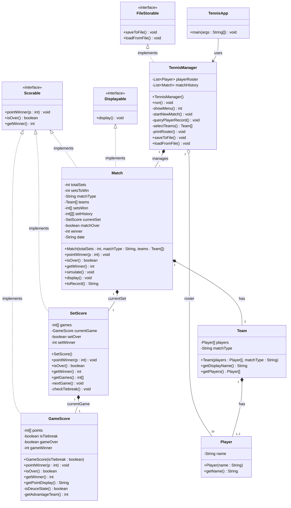

# 테니스 게임 클래스 다이어그램

## 전체 구조



---

## 인터페이스 설명

| 인터페이스 | 구현 클래스 | 역할 |
|---|---|---|
| `Scorable` | `GameScore`, `SetScore`, `Match` | 포인트 득점 처리 및 승리 판정의 공통 규약 |
| `Displayable` | `Match` | 스코어보드 출력 규약 |
| `FileStorable` | `TennisManager` | 결과 파일 저장/불러오기 규약 |

---

## 클래스별 책임

### `TennisApp`
- 프로그램 진입점
- `TennisManager` 생성 후 `run()` 호출

### `TennisManager`
- 전체 흐름 제어 (메뉴, 경기 생성, 기록 조회)
- 10명의 사전 등록 선수 목록(`playerRoster`) 관리
- 완료된 경기 이력(`matchHistory`) 관리
- 경기 결과 파일 저장/불러오기 (`FileStorable` 구현)

| 메서드 | 설명 |
|---|---|
| `run()` | 메인 메뉴 루프 실행 |
| `startNewMatch()` | 세트 수·단복식·선수 선택 → Match 생성 → 시뮬레이션 |
| `queryPlayerRecord()` | 선수 이름 입력 → 파일에서 기록 검색 후 출력 |
| `selectTeams()` | 단식(2명) / 복식(4명) 선수 선택, 중복 방지 |
| `saveToFile()` | 경기 결과를 `results.txt`에 누적 저장 |
| `loadFromFile()` | `results.txt`를 읽어 기록 조회 |

---

### `Player`
- 선수 한 명의 이름 정보를 보관
- 10명 사전 등록 선수 중 하나

### `Team`
- 단식: `Player` 1명 보유
- 복식: `Player` 2명 보유
- `getDisplayName()` : 단식이면 선수 이름, 복식이면 `"선수A / 선수B"` 반환

---

### `Match` — `Scorable` + `Displayable` 구현
- **매치 전체**를 관리 (세트 수, 팀, 세트 스코어 이력)
- `simulate()` : `Math.random()`으로 득점 팀을 결정하며 `pointWinner()` 반복 호출
- `pointWinner(int p)` : `currentSet.pointWinner(p)` 위임 → 세트 종료 시 갱신

| 필드 | 설명 |
|---|---|
| `totalSets` | 경기 세트 수 (3 또는 5) |
| `setsToWin` | 승리 필요 세트 수 (2 또는 3) |
| `matchType` | `"단식"` 또는 `"복식"` |
| `teams` | 경기에 참가하는 두 팀 |
| `setsWon` | 각 팀의 세트 승리 수 |
| `setHistory` | 완료된 세트별 게임 스코어 기록 `[세트][팀]` |
| `currentSet` | 현재 진행 중인 `SetScore` |

---

### `SetScore` — `Scorable` 구현
- **하나의 세트** 관리 (게임 수 누적, 타이브레이크 진입)
- `pointWinner(int p)` : `currentGame.pointWinner(p)` 위임 → 게임 종료 시 `games` 갱신
- `checkTiebreak()` : `games[0] == 6 && games[1] == 6` 이면 타이브레이크 게임 시작

| 필드 | 설명 |
|---|---|
| `games` | 현재 세트에서 각 팀의 게임 수 |
| `currentGame` | 현재 진행 중인 `GameScore` |
| `setOver` | 세트 종료 여부 |
| `setWinner` | 세트 승자 (0=진행 중, 1 또는 2) |

세트 승리 조건:
- 6게임 이상 AND 2게임 이상 차이 (`6-0` ~ `7-5`)
- 또는 타이브레이크 게임 승리 → `7-6`

---

### `GameScore` — `Scorable` 구현
- **하나의 게임** 관리 (포인트 계산, 듀스/어드밴티지/타이브레이크)

| 필드 | 설명 |
|---|---|
| `points` | 각 팀의 내부 포인트 수 |
| `isTiebreak` | 타이브레이크 게임 여부 |
| `gameOver` | 게임 종료 여부 |
| `gameWinner` | 게임 승자 (0=진행 중, 1 또는 2) |

| 메서드 | 설명 |
|---|---|
| `getPointDisplay()` | `0→"0"`, `1→"15"`, `2→"30"`, `3→"40"`, 듀스/어드밴티지/타이브레이크 점수 문자열 반환 |
| `isDeuceState()` | 양쪽 모두 3점 이상 AND 동점 여부 반환 |
| `getAdvantageTeam()` | 어드밴티지 보유 팀 반환 (0=없음) |

게임 승리 조건:
- 일반: 4점 이상 AND 2점 이상 차이
- 타이브레이크: 7점 이상 AND 2점 이상 차이

---

## 점수 처리 위임 흐름

```
TennisManager.startNewMatch()
    │
    └── Match.simulate()
            │  (Math.random()으로 득점 팀 결정 반복)
            │
            └── Match.pointWinner(p)
                    │
                    └── SetScore.pointWinner(p)
                            │
                            └── GameScore.pointWinner(p)
                                    │
                            GameScore.isOver() == true
                                    │
                            SetScore: games 갱신, nextGame()
                                    │
                            SetScore.isOver() == true
                                    │
                            Match: setHistory 기록, setsWon 갱신
                                    │
                            Match.isOver() == true
                                    │
                            Match.display() + TennisManager.saveToFile()
```

---

## 파일 저장 형식 (`results.txt`)

```
DATE=2026-06-10
TYPE=단식
SETS=3
TEAM1=Nadal
TEAM2=Federer
SCORE=6-3,7-6(5)
WINNER=Nadal
---
DATE=2026-06-10
TYPE=복식
SETS=3
TEAM1=Nadal/Djokovic
TEAM2=Federer/Alcaraz
SCORE=6-4,3-6,6-3
WINNER=Nadal/Djokovic
---
```
